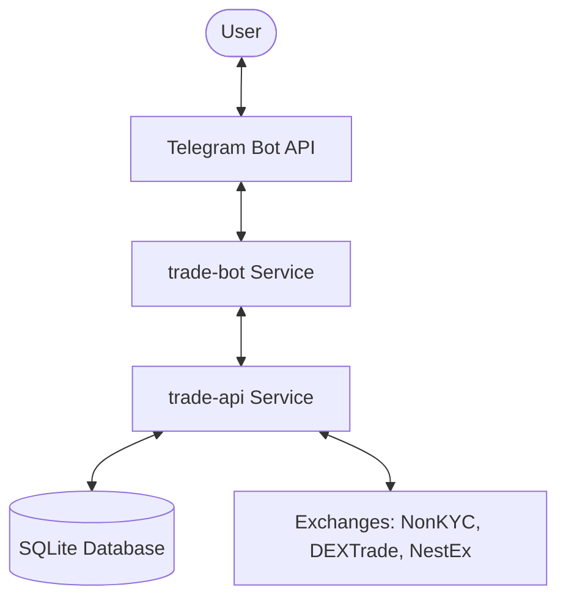

# PepePow Trading Suite Architecture

This document provides a high-level overview of the PepePow Trading Suite architecture, detailing the components, data flow, and interactions between the `trade-api` and `trade-bot` services.

## Overview

The PepePow Trading Suite is a decentralized trading system designed for the PepePow ecosystem. it consists of two primary services:

1.  **`trade-api`**: A backend service responsible for managing trading strategies, interacting with exchanges, and maintaining the system's state in a local database.
2.  **`trade-bot`**: A Telegram-based interface that allows users to configure, monitor, and control their trading strategies through a user-friendly wizard.

## System Components

### 1. `trade-api` (Backend)
- **Language**: TypeScript/Node.js
- **Framework**: Express.js
- **Database**: SQLite (via `better-sqlite3`) for strategy configs, orders, and logs.
- **Scheduler**: Orchestrates strategy "ticks" every 10 seconds.
- **Strategy Runners**: Core logic for DCA, GRID, and MM strategies.
- **Exchanges**: Custom adapters for NonKYC, DEXTrade, and NestEx APIs.

### 2. `trade-bot` (Frontend)
- **Language**: TypeScript/Node.js
- **Framework**: grammY (Telegram Bot Framework)
- **Functions**:
    - Interactive wizards for strategy setup.
    - Status reporting and balance checks.
    - Command-based control (start/stop/set).
    - API Key management (delegated to `trade-api` for secure storage).

## Data Flow

### Strategy Execution (The "Tick")
1.  **Scheduler** (in `trade-api`) triggers every 10 seconds.
2.  It fetches all **enabled** strategies from the database.
3.  For each strategy, the corresponding **Runner** (DCA, GRID, or MM) executes a `tick()`.
4.  The Runner:
    - Fetches current market prices and account balances.
    - Evaluates strategy logic (e.g., "should I buy now?").
    - Placed or cancels orders on the exchange.
    - Logs actions and updates local state in the DB.

### User Interaction (Telegram)
1.  User sends a command (e.g., `/dca`) to the bot.
2.  `trade-bot` guides the user through a multi-step configuration wizard.
3.  Once completed, `trade-bot` sends the configuration to `trade-api` via a POST request.
4.  `trade-api` validates the config, stores it in the DB, and starts the scheduler if it wasn't already running.

## Security
- **API Keys**: Stored in the `trade-api` database, encrypted using AES-256-GCM.
- **Encryption Key**: Derived from the `KEYS_ENC_KEY` environment variable.
- **User Privacy**: Telegram user IDs are handled securely; sensitive logs are minimized.

## Environment Variables
Both services rely on environment variables for configuration (e.g., `TRADE_BOT_TOKEN`, `TRADE_API_BASE`). See the respective `.env.example` files for details.
