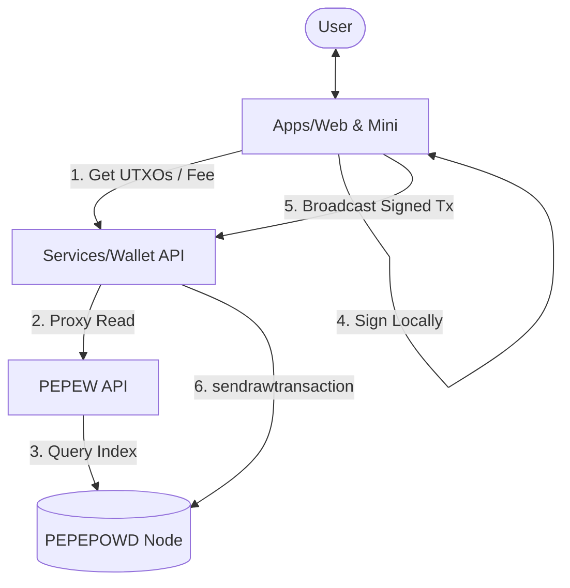

# Architecture: PEPEPOW Wallet Suite

The PEPEPOW Wallet Suite is composed of four main components interacting in a decentralized, non-custodial manner.

## Components

### 1. Web / Mini App (Client)
- **Tech Stack**: React, Vite, Ethers.js (or custom wallet logic).
- **Responsibility**: Mnemonic generation, address derivation (BIP44), transaction signing, and UI presentation.
- **Security**: Holds the only copy of the user's secret keys in memory/local storage (encrypted).

### 2. Wallet API (Backend)
- **Tech Stack**: Node.js (Express).
- **Responsibility**: Authenticates Telegram users, estimates transaction fees, broadcasts signed raw transactions to the node, and provides metadata (e.g., coin price).
- **Security**: Acts as a gateway. It does not possess any user keys.

### 3. PEPEW API (Indexer)
- **Tech Stack**: Node.js (Fastify).
- **Responsibility**: Proxies read-only requests for balance, UTXOs, and history. It parses raw blockchain data for efficient client consumption.
- **Security**: Read-only access to the blockchain.

### 4. PEPEPOWD (Core Node)
- **Responsibility**: The source of truth for the PEPEPOW blockchain. Validates blocks and transactions.

## Data Flow (Simplified)

## Design Decisions

- **Stateless Backend**: The backend is largely stateless regarding user accounts. Users are "identified" by their public keys or Telegram IDs.
- **Decoupled Indexing**: The `pepew-api` is separated from the `wallet-api` to allow the indexer to scale independently and be reused by other services (e.g., block explorers).
- **No-Docker Philosophy**: Designed for direct deployment on Linux servers to minimize overhead and simplify node-to-app communication via local sockets or loopback.
