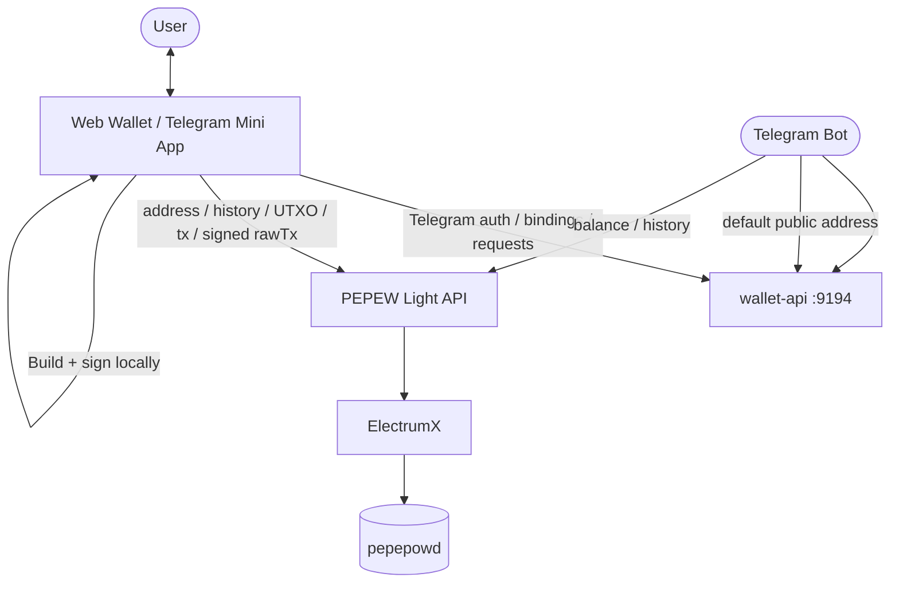

# Architecture: PEPEPOW Wallet Suite

> Status: **approved target architecture** for the PEPEW Light migration.
>
> M0 is documentation-only. Production runtime may still use legacy `wallet-api -> pepew-api -> pepepowd` and direct RPC paths until M1-M6 in `docs/LIGHT_API_MIGRATION.md` are completed.

## Core principles

The Wallet Suite is non-custodial.

- Mnemonic phrases and private keys stay on the client.
- Transaction construction and signing happen on the client.
- Backend services never derive keys or sign transactions.
- Only public addresses, txids, read options, product metadata, and already-signed raw transactions may cross the wallet API boundary.
- Telegram identity/product functions and blockchain chain-access functions are separate domains.

## Target architecture


```mermaid
graph TD
    User([User]) <--> Client[Web Wallet / Telegram Mini App]
    TG([Telegram Bot]) --> Control[wallet-api :9194]

    Client -- "Telegram auth / bindings / requests" --> Control
    Client -- "address / history / UTXO / tx / signed rawTx" --> Light[PEPEW Light API]
    TG -- "default public address" --> Control
    TG -- "balance / history" --> Light

    Light --> EX[ElectrumX]
    EX --> Node[(pepepowd)]

    Client -- "Build + sign locally" --> Client
```

### Security boundary

```text
CLIENT SECRET DOMAIN
- mnemonic
- private keys
- WIF / seed / xprv
- transaction signing

PUBLIC/CONTROL DATA
- Telegram identity
- public wallet address
- payment-request metadata

CHAIN DATA PLANE
- PEPEW Light API
- ElectrumX
- pepepowd
```

ElectrumX and pepepowd must not be exposed directly to browser clients.

## Components

### Web Wallet / Telegram Mini App

Single non-custodial wallet client.

Responsibilities:

- create/import mnemonic;
- derive PEPEPOW addresses;
- UTXO selection;
- fetch previous transaction material needed to construct P2PKH spends;
- construct and sign transactions locally;
- submit signed raw transaction only;
- balance/history/receive/send UI;
- stale-UTXO and recent-spent reconciliation.

The Light Wallet repository is the reference implementation for Light API integration and send resilience.

### wallet-core

Client-side wallet primitives only.

Canonical PEPEPOW parameters:

```text
P2PKH  0x37
P2SH   0x10
WIF    0xCC
HD     m/44'/5'/0'/0/x
PEPEW  8 decimal places
```

### wallet-api :9194

Target role: authenticated **control plane** for Telegram/product features.

Responsibilities:

- verify Telegram WebApp `initData`;
- issue short-lived JWTs;
- Telegram user/profile metadata;
- default public address binding;
- username / user-id resolution;
- payment request and claim flows;
- Telegram bot webhook;
- other product-specific state that does not require wallet secrets.

The target wallet-api does **not**:

- index chain data;
- proxy balance/UTXO/history;
- look up raw transactions for wallet signing;
- broadcast by direct pepepowd RPC;
- hold a raw-tx hot cache;
- sign transactions.

### PEPEW Light API

Implemented by `edisontw/pepepow-electrumx-service`.

Approved wallet chain contract:

```text
GET  /api/wallet/address/{address}
GET  /api/wallet/history/{address}
GET  /api/wallet/utxo/{address}
GET  /api/wallet/tx/{txid}
POST /api/wallet/broadcast
```

Responsibilities:

- validate public wallet query inputs;
- provide ElectrumX-backed balance/history/UTXO/tx data;
- accept only an already-signed raw transaction for broadcast;
- enforce safe errors, request-size limits, and rate limits.

It must not receive or process mnemonic/private-key/signing requests.

### ElectrumX

Private indexed chain interface used by PEPEW Light API.

### pepepowd

Canonical blockchain authority.

PEPEW Light API / ElectrumX may ultimately communicate with pepepowd, but Wallet Suite product services must not create parallel direct-RPC chain access after migration.

## Telegram data flows

### Mini App authentication

```text
Telegram WebApp initData
 -> wallet-api /auth/telegram
 -> verified Telegram identity
 -> short-lived JWT
```

JWT is for Telegram/product endpoints. Public Light API chain reads do not become custodial or identity-dependent.

### Bot balance/history

```text
Telegram command
 -> wallet-api: resolve user's default public address
 -> PEPEW Light API: address/history query
 -> Bot formats response
```

### Client send

```text
derive sender locally
 -> Light API fresh UTXO
 -> local coin selection
 -> Light API previous tx/raw data if required
 -> local transaction build
 -> local signing
 -> Light API POST /api/wallet/broadcast
 -> refresh/reconcile wallet state
```

## Transitional runtime

The following are legacy migration paths, not the target architecture:

```text
wallet-api -> PEPEW Light API /api/status
wallet-api -> Telegram Bot API getMe
```

M6a retired read proxies, M6b raw-tx compatibility, M6c direct wallet-api broadcast, and M6d source removes Wallet API `pepew-api`/direct-RPC readiness dependencies. `pepew-api :9193` remains a separate legacy service for other consumers.

### M5 fee policy

M5 uses a deterministic client-side P2PKH size policy with a 0.0001 PEPEW minimum and 0.0001 PEPEW/kB rate. The Mini App/Web Wallet computes the transaction fee locally from input/output count, and wallet-api no longer exposes `/wallet/fee/estimate`.

Remaining wallet-api direct-RPC compatibility and diagnostic paths are legacy and deferred to M6 cleanup.

## Repository boundaries

| Repository | Responsibility |
| --- | --- |
| `pepepow-wallet-suite` | Telegram Bot, Mini App/product UX, wallet-api control plane, shared client wallet logic |
| `pepepow-light-wallet` | Public Light Wallet reference client and proven Light API/send behavior |
| `pepepow-electrumx-service` | PEPEW Light API gateway, cache, validation, wallet read/broadcast contract |
| `electrumx-pepepow` | PEPEPOW ElectrumX chain support |
| `pepepowd` | Blockchain consensus/node authority |

## Backend storage policy

Forbidden:

- private keys;
- mnemonic / recovery phrase;
- seed / xprv / WIF;
- data capable of reconstructing keys.

Allowed when needed:

- Telegram user metadata;
- bound public addresses;
- labels;
- payment request metadata;
- bounded operational caches.

Avoid long-term identity/address/IP correlation not required for product operation.

## Migration and rollback discipline

Follow `docs/LIGHT_API_MIGRATION.md`.

Each runtime milestone must:

1. change one coherent layer;
2. preserve a rollback path;
3. compare old/new response semantics;
4. test invalid address, timeout, 429, upstream failure, and stale UTXO behavior where applicable;
5. verify no mnemonic/private key crosses a network boundary;
6. update docs when behavior changes.

## Final architecture acceptance

Migration is complete only when Wallet Suite can lose access to local pepepowd RPC without breaking:

- Telegram Bot balance/history;
- Mini App balance/history;
- UTXO lookup;
- previous transaction lookup;
- signed transaction broadcast.

Fee policy must also be independent from Wallet API direct RPC by that point.
